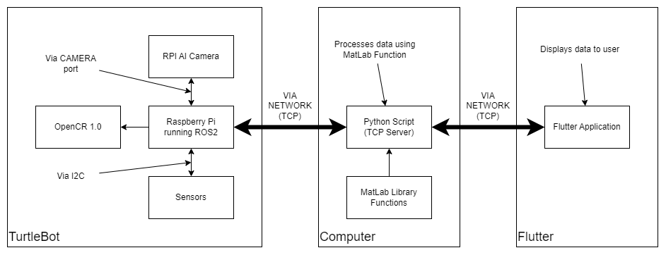

# Cubiclean_Farm_Robot
Development of a Robotic Platform for Remote Sensing of Animal Bedding Conditions As A Means of Detecting Animal Disease.

#Authors
Jade Cawley
Brandon Craddock
Spencer Jones
Rameez Shiekh
Gideon Tladi

To build the flutter app on a new device, you need to delete the 'build' folder within the data_viewer folder as it is device specific. You may need to run-debug the project twice. Also, don't run the flutter app on a web emulator as the library used for networking is not compatible with web apps.