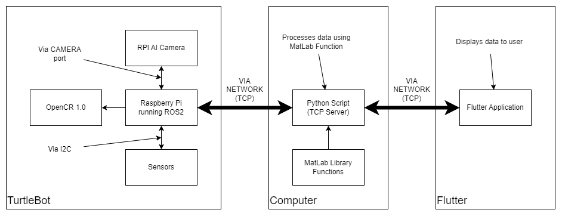

# Cubiclean Farm Robot — Project Overview

## What Is Cubiclean?

Cubiclean is a robotic platform designed to **remotely sense animal bedding conditions as a means of detecting animal disease**. A TurtleBot3 Burger autonomously navigates a pre-defined waypoint grid over animal bedding, pausing at each point to collect chemical/gas sensor readings. Those readings are transmitted to a backend server, stored, and displayed to an operator via a web dashboard or mobile/desktop app.

The system is intended to allow early, non-invasive detection of disease indicators in livestock housing — replacing or supplementing manual inspection with continuous, automated monitoring.

**Repository:** [https://github.com/gtcodes22/Cubiclean_Farm_Robot](https://github.com/gtcodes22/Cubiclean_Farm_Robot)

**Project team:** Jade Cawley, Brandon Craddock, Spencer Jones, Rameez Shiekh, Gideon Tladi.



---

## System Architecture

The system is divided into five layers:

```
┌─────────────────────────────────────────────────────────┐
│                     Operator Layer                      │
│         data_viewer (Flutter)  /  bed_webview (Dash)    │
└────────────────────────┬────────────────────────────────┘
                         │ HTTP
┌────────────────────────▼────────────────────────────────┐
│                     Server Layer                        │
│              server_main.py  ←  bed_data/               │
└────────────────────────┬────────────────────────────────┘
                         │ Network
┌────────────────────────▼────────────────────────────────┐
│                      Bot Layer                          │
│    bot_main.py  →  bot_get_readings.py  →  turtlebot_client │
└────────────────────────┬────────────────────────────────┘
                         │ Onboard
┌────────────────────────▼────────────────────────────────┐
│                   Navigation Layer                      │
│        turtlebot3_ws  /  turtlebot3_autonomy            │
└────────────────────────┬────────────────────────────────┘
                         │ Hardware
┌────────────────────────▼────────────────────────────────┐
│                    Sensor Layer                         │
│              chemical_sensor_drivers/                   │
└─────────────────────────────────────────────────────────┘
```

---

## Components

### 1. `turtlebot3_ws/` — Navigation Layer (ROS2)

The ROS2 Jazzy workspace containing the `turtlebot3_autonomy` package. This is the core navigation layer of the system.

**Key responsibilities:**
- Autonomous waypoint navigation using Nav2
- AMCL-based localisation on a pre-loaded map
- Robot status monitoring (battery, speed, CPU)
- Telemetry publishing to Foxglove for visualisation
- Integration stub (`data_logger()`) for chemical sensor readings at each waypoint

**Main package:** `turtlebot3_autonomy`

| Module | Description |
|---|---|
| `waypoint_mission.py` | Loads waypoints from YAML, publishes initial pose to AMCL, navigates the full grid, calls `data_logger()` at each stop |
| `robot_monitor.py` | Subscribes to `/battery_state` and `/odom`, publishes telemetry on `/robot/battery_percent`, `/robot/speed`, `/robot/cpu_usage`, `/robot/battery_low` |
| `utils/battery_monitor.py` | Utility class for battery state subscription and low-battery checks |
| `autonomous_nav.launch.py` | Launch file — starts Nav2 (via `turtlebot3_navigation2`), the mission node, and the monitor node |
| `waypoints.yaml` | Pre-defined 17-point grid over the bedding area |
| `cubiclean_autonav.yml` | Tmuxinator config launching Gazebo, autonomy, ros2bag recording, and Foxglove bridge in parallel |

**Session launch:**
```bash
export TURTLEBOT3_MODEL=burger
tmuxinator start cubiclean_autonav
```

**Session teardown:**
```bash
kill_autonav   # pkill -9 all ROS2/Gazebo processes + ros2 daemon restart
```

For full detail on this layer — including all resolved bugs — see `turtlebot3_autonomy_v0_0_8.md`.

---

### 2. `chemical_sensor_drivers/` — Sensor Layer

Hardware drivers for the onboard gas and chemical sensors mounted on the TurtleBot3. These drivers are consumed by `bot_get_readings.py` via `sci_i2c_logger_unified`.

**Sensors measured at each waypoint:**

| Sensor | Measurement |
|---|---|
| DAQ1 — p2 | Air temperature, air humidity |
| DAQ1 — p3 | CO₂ concentration |
| DAQ2 — d2 | NH₃ (ammonia), H₂S (hydrogen sulphide) |
| ADC | CH₄ (methane) voltage output |

The integration point with the navigation layer is `data_logger()` in `waypoint_mission.py`, which is currently a stub. When fully integrated, `data_logger()` will trigger `bot_get_readings.py` at each waypoint pause.

---

### 3. `bot_main.py` + `bot_get_readings.py` — Bot Scripts

Python scripts that run directly on the TurtleBot3 hardware (not containerised).

**`bot_main.py`** is the main entry point on the robot. It:

- Accepts an optional `ip_address:port` argument. If not provided (or `?`), it auto-discovers the server by listening for a UDP broadcast on port `1995` — attempting up to 5 times with a 2s timeout each.
- Once the server is found, connects via TCP to `server_main.py` on port `1991`.
- Opens a local TCP socket on `127.0.0.1:1993` for inter-process communication with `bot_get_readings.py`.
- Spawns a `query_handler` thread (from `turtlebot_client/`) to handle incoming commands from the server.
- Main loop: waits for filenames on the local socket. When `bot_get_readings.py` signals that a CSV has been written, `bot_main.py` reads the filename and forwards the CSV data to the server via `send_csv_data_to_server()`.

**`bot_get_readings.py`** handles sensor data collection at each waypoint. It runs in three stages:

- **Stage 1 (Brandon's function):** Calls `run_logger()` from `sci_i2c_logger_unified` to collect chemical sensor readings over a 30-second window (5s sampling period) and write them to a CSV. Sensors measured include temperature, humidity, CO₂, NH₃, H₂S, and CH₄. Files are named using the pattern `BED{n}_P{n}_{timestamp}.csv`. A `--test` flag bypasses real hardware and writes a zero-value CSV instead.
- **Stage 2 (Rameez's function):** Runs `odomcsv.main()` in a parallel thread to capture odometry data during the sensor collection window, writing a companion `_odom.csv` file alongside the sensor CSV.
- **Stage 3 (Jade's function):** Sends both the sensor CSV path and the odom CSV path to `bot_main.py` via the local socket on `127.0.0.1:1993`, which then forwards them to the server.

Bed and point numbers are tracked across calls using `increment_bed_point()`, which increments the point number up to 6 before rolling over to the next bed number.

---

### 4. `turtlebot_client/` — Client Bridge

Client-side code that runs on the TurtleBot3 and bridges the bot scripts to the server. Contains three modules used by `bot_main.py`:

- **`turtlebot.py`** — `TurtleBot` class managing robot state, including a `closing` flag used to signal clean shutdown across threads.
- **`query_handler.py`** — Runs in a daemon thread; handles incoming command queries from the server over the TCP connection.
- **`send_csv.py`** — `send_csv_data_to_server()` — reads a CSV file from disk and transmits its contents to `server_main.py` over the established TCP connection.

---

### 5. `server/` + `server_main.py` — Server Layer

The backend server runs on a PC (not the robot) and is built around a **PySide6 Qt GUI** with three concurrent threads:

- **`ThreadedTCPServer` thread** — Listens on `0.0.0.0:1991` for incoming TCP connections from `bot_main.py`. Receives CSV sensor data and stores it in `bed_data/`. Uses a two-queue architecture (`qMain`, `qThread`) to communicate between the TCP server thread and the Qt main thread.
- **Dash HTTP Server thread** — Runs the `bed_webview` Dash app on `0.0.0.0:8050`, serving the web dashboard directly from `server_main.py`. Reads CSVs from `./bed_data/` and refreshes every 5 seconds.
- **Qt main thread** — Runs the `mainwindow` PySide6 GUI via `mainwindow.start_ui()`. The GUI provides operator controls and status visibility. On close, triggers `server.shutdown()` and exits cleanly.

The `server/` subdirectory contains the TCP server implementation (`ThreadedTCPServer.py`), packet definitions (`packet.py`), the Qt window code (`pyqt/mainwindow.py`), and a socket utility (`is_socket_closed.py`).

> **Note:** The Dash web dashboard runs on port **8050** (not 8080 as in the Docker config). Adjust the Docker compose port mapping if needed: `"8050:8050"`.

---

### 6. `bed_data/` — Data Store

Directory of stored sensor readings from bedding inspections. Written to by `server_main.py` and read by the operator-facing interfaces. Persisted as a Docker volume when running containerised.

---

### 7. `bed_webview/` — Web Dashboard

A browser-based dashboard for viewing bedding condition data. Built with **plain HTML, Plotly, and Dash** (Python). Runs on port 8080 and connects to the server on port 5000.

- Visualises sensor readings per waypoint over time
- Plotly charts for gas/chemical concentration trends
- No Node.js or frontend build step — Dash's built-in server handles everything
- Entry point is `app.py` or `main.py`

---

### 8. `data_viewer/` — Flutter App (Mobile + Desktop)

A Flutter application for viewing bedding condition data. Connects to the server on port 5000.

**Deployment targets:**
- **Android / iOS** — Flutter mobile app (run on physical device)
- **Windows / Linux** — Compiled Flutter desktop executable

> **Note:** Do not run on a web emulator — the networking library used is not compatible with Flutter web builds. When building on a new device, delete the `build/` folder inside `data_viewer/` before compiling as it is device-specific. You may need to run/debug the project twice on first build.

---

## Data Flow (Full Pipeline)

```
TurtleBot3 pauses at waypoint
        ↓
bot_get_readings.py — Stage 1 (Brandon):
  run_logger() reads chemical sensors over 30s
  → writes BED{n}_P{n}_{timestamp}.csv to out/
        ↓ (parallel)
bot_get_readings.py — Stage 2 (Rameez):
  odomcsv.main() captures odometry data
  → writes BED{n}_P{n}_{timestamp}_odom.csv
        ↓
bot_get_readings.py — Stage 3 (Jade):
  sends both CSV paths to bot_main.py
  via local TCP socket on 127.0.0.1:1993
        ↓
bot_main.py receives filenames
  → send_csv_data_to_server() transmits CSVs
  via TCP to server_main.py on port 1991
        ↓
server_main.py (ThreadedTCPServer) receives CSVs
  → stores in bed_data/
        ↓
    ┌───┴──────────────┐
    ↓                  ↓
bed_webview          data_viewer
Dash on port 8050    Flutter (mobile / PC executable)
(served by           connects to server on port 1991
server_main.py)
```

---

## Telemetry Topics (Foxglove / RViz2)

Published by `robot_monitor.py` and viewable in Foxglove Studio via the Foxglove bridge:

| Topic | Type | Description |
|---|---|---|
| `/robot/battery_percent` | `Float32` | Current battery percentage (0–1) |
| `/robot/speed` | `Float32` | Current robot speed (m/s) |
| `/robot/cpu_usage` | `Float32` | Host CPU usage (%) |
| `/robot/battery_low` | `Bool` | True if battery < 25% |

---

## Repository Structure

```
Cubiclean_Farm_Robot/
│
├── turtlebot3_ws/               ← ROS2 Jazzy workspace (navigation)
│   └── src/turtlebot3/
│       └── turtlebot3_autonomy/
│           ├── launch/
│           ├── config/waypoints.yaml
│           ├── maps/
│           └── turtlebot3_autonomy/
│               ├── waypoint_mission.py
│               ├── robot_monitor.py
│               └── utils/battery_monitor.py
│
├── chemical_sensor_drivers/     ← Hardware drivers for onboard sensors
├── bed_data/                    ← Stored sensor readings
├── bed_webview/                 ← Dash/Plotly web dashboard
├── data_viewer/                 ← Flutter app (mobile + PC executable)
├── server/                      ← Server supporting code
├── turtlebot_client/            ← Robot-to-server bridge
│
├── bot_main.py                  ← Main script on the robot
├── bot_get_readings.py          ← Sensor packaging + transmission
├── server_main.py               ← Backend data server entry point
│
├── Dockerfile                   ← Multi-stage Docker build
├── docker-compose.yml           ← Orchestrates ros2, server, bed_webview
├── entrypoint.sh                ← Per-service container startup
│
└── README.md
```

---

## Docker Deployment

Three services are containerised. The Flutter app and physical bot scripts run outside Docker.

| Container | Base Image | Port | Description |
|---|---|---|---|
| `cubiclean_ros2` | `osrf/ros:jazzy-desktop-full` | host network | ROS2, Nav2, Gazebo, Foxglove bridge |
| `cubiclean_server` | `python:3.11-slim` | 1991 (TCP), 8050 (Dash) | Backend data server + Dash web dashboard |
| `cubiclean_webview` | `python:3.11-slim` | 8050 | Dash/Plotly web dashboard |

> **Note:** `server_main.py` uses a **PySide6 Qt GUI** as its main thread. In a headless Docker container this will fail unless either: (a) X11 forwarding is configured, or (b) `server_main.py` is refactored to run headlessly (launching the TCP server and Dash thread directly, without the Qt window). The Dash dashboard itself runs fine headlessly on port 8050.

**Not containerised:**
| Component | Reason |
|---|---|
| `data_viewer` | Native GUI — runs as Flutter mobile app or compiled PC executable |
| `bot_main.py` / `bot_get_readings.py` | Run directly on TurtleBot3 hardware |
| `turtlebot_client` | Runs on the physical robot |

**Launch:**
```bash
docker compose up --build
```

**Build a single service:**
```bash
docker build --target ros2 -t cubiclean_ros2 .
docker build --target server -t cubiclean_server .
docker build --target bed_webview -t cubiclean_webview .
```

---

## Technology Stack

| Layer | Technology |
|---|---|
| Robot navigation | ROS2 Jazzy, Nav2, AMCL, TurtleBot3 Burger |
| Simulation | Gazebo |
| Visualisation | RViz2, Foxglove Studio |
| Session management | tmux, tmuxinator |
| Bot scripts | Python 3, threading, TCP sockets |
| Server | Python 3, PySide6 (Qt), ThreadedTCPServer |
| Web dashboard | Python 3, Dash, Plotly, HTML (served from server_main.py on port 8050) |
| Mobile / desktop app | Flutter (Dart) |
| Containerisation | Docker, Docker Compose |
| Languages | Python, C++, C#, C, Java, Dart |

---

## Known Limitations & Future Enhancements

- `data_logger()` in `waypoint_mission.py` is currently a stub — full chemical sensor integration is pending.
- Battery-aware mission abort / return-to-dock not yet implemented.
- Waypoint visualisation markers in RViz2 do not yet auto-load.
- An aggregated `/robot_health` topic (combining battery, speed, CPU) is planned.
- Integration of an AI camera and additional sensors for per-waypoint telemetry could be considered for future development.
- The `data_viewer` Flutter app cannot be run on a web emulator due to networking library incompatibility.
